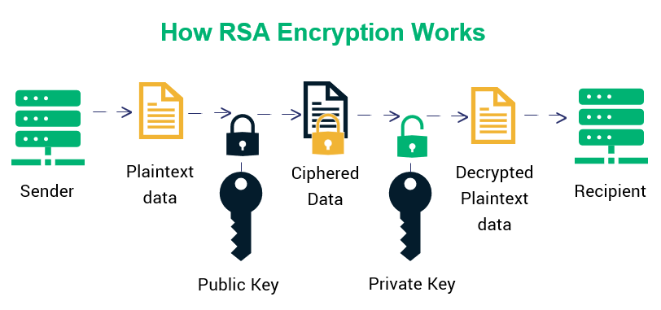

# RSA Encryption & Decryption Algorithm Implementation in Python

## Overview

This project implements the RSA encryption and decryption algorithm in Python. RSA (Rivest–Shamir–Adleman) is a widely-used asymmetric cryptographic algorithm for secure data transmission.

The project consists of two programs:

1. **Program-A**: Generates public and private keys required for encryption and decryption. It also performs decryption.
2. **Program-B**: Performs encryption of user text input using the public key generated by Program-A.

## Files Included

1. `program_A.py`: Python script for generating keys and performing decryption.
2. `program_B.py`: Python script for performing encryption using user input.
3. `README.md`: Documentation file explaining the project and how to use it.

## Usage

### Program-A

1. Run `program_A.py`.
2. Follow the instructions to generate the public and private keys.
3. After keys are generated, the program will prompt for ciphertext input.
4. Enter the ciphertext to decrypt.

### Program-B

1. Run `program_B.py`.
2. Enter the plaintext you want to encrypt when prompted.
3. The program will use the public key generated by Program-A to encrypt the input text.
4. The encrypted ciphertext will be displayed.

## Dependencies

This project requires Python 3.x to run. No external libraries are used.

## Note

Ensure that you keep your private key secure. Anyone with access to the private key can decrypt the messages encrypted with the corresponding public key.

## Disclaimer

This implementation is for educational purposes only. For production use, it's recommended to use well-tested libraries and consult with security experts to ensure the security of your cryptographic implementations.

## Author

[Kaustubh Gupta]

